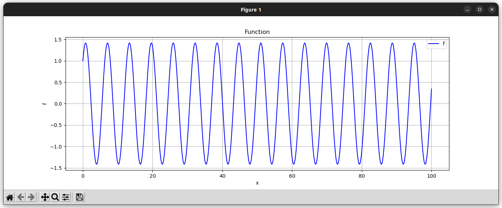

# Mather
A math interpreter that is able to parse, evaluate and draw mathematical expressions and functions.

# Pre-Requesites
* Python3 
* matplotlib package ```pip install matplotlib```

# Try Mather
To play with the interpreter, copy and paste the following:
```console
git clone https://github.com/DjoCoding/mather.git
./run.sh
```

# Features
mather features multiple things:

## Evaluate arithmetic expressions
It will evaluate any arithmetic expression for you:
```python
>  1 + 1
2
>  (1 / 2) + 1
1.5
```

## Define functions
It follows a Python-Like syntax for defining functions using the `def` keyword.

### Syntax
Here's the syntax for defining functions:
```python
> def <name>([var,+]|var) = <expression>
```

### Examples
```python
> def f(x) = 1 + x
f([x])
> def g(x) = cos(x) + sin(x)
g([x])
```

## Evaluate functions
```python
> f(2)
3
> g(0)
1
```

## Draw One-Dimensional functions
This is possible using the `draw` keyword that will draw the specified function for you
### Note
* `draw` uses the `matplotlib` package underneath the hood, make sure to install it first.
* `draw` is only able to draw one-dimensional functions (functions with a single variable).

### Syntax
Here's the syntax for draw functions:
```python
> draw(<name>, <lower_bound>, <upper_bound>, <step>)
```

### Examples
```python
> draw(g, 0, 10, 0.001)
```
